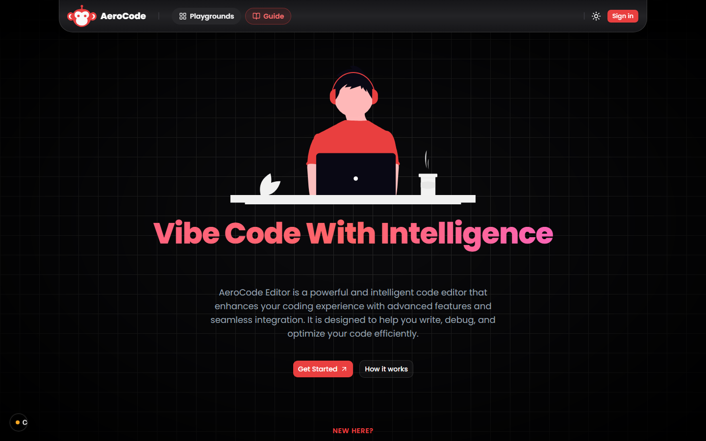
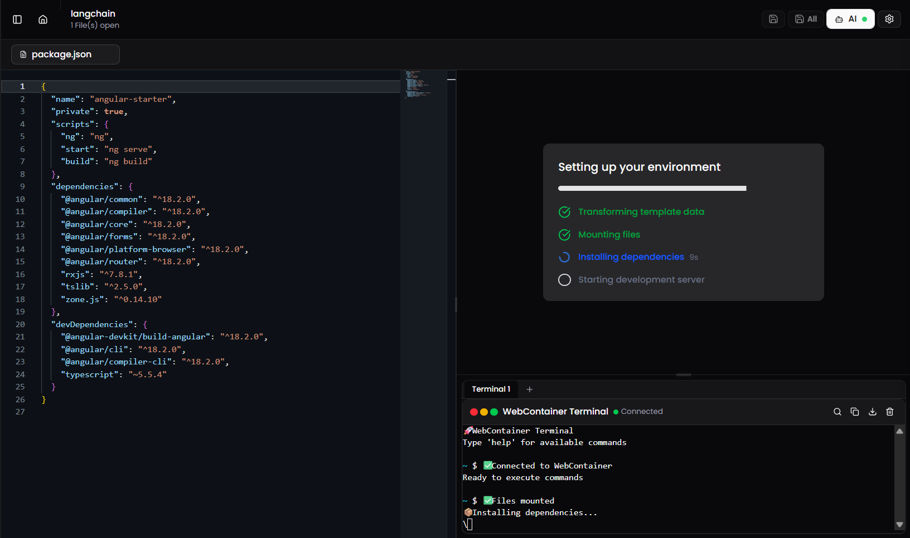
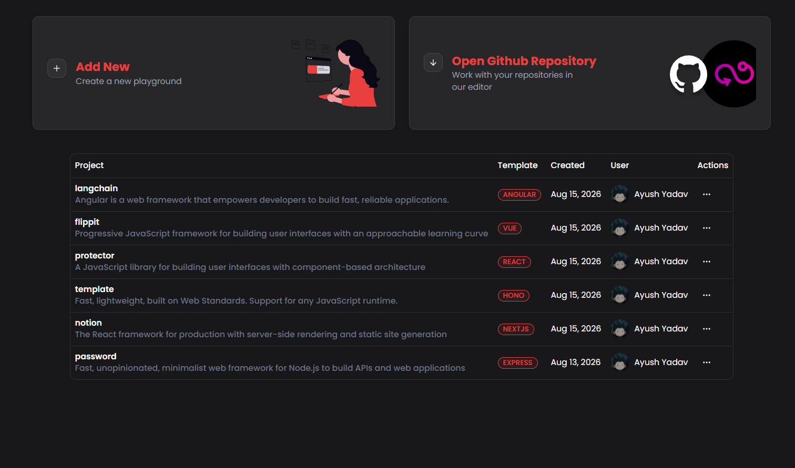
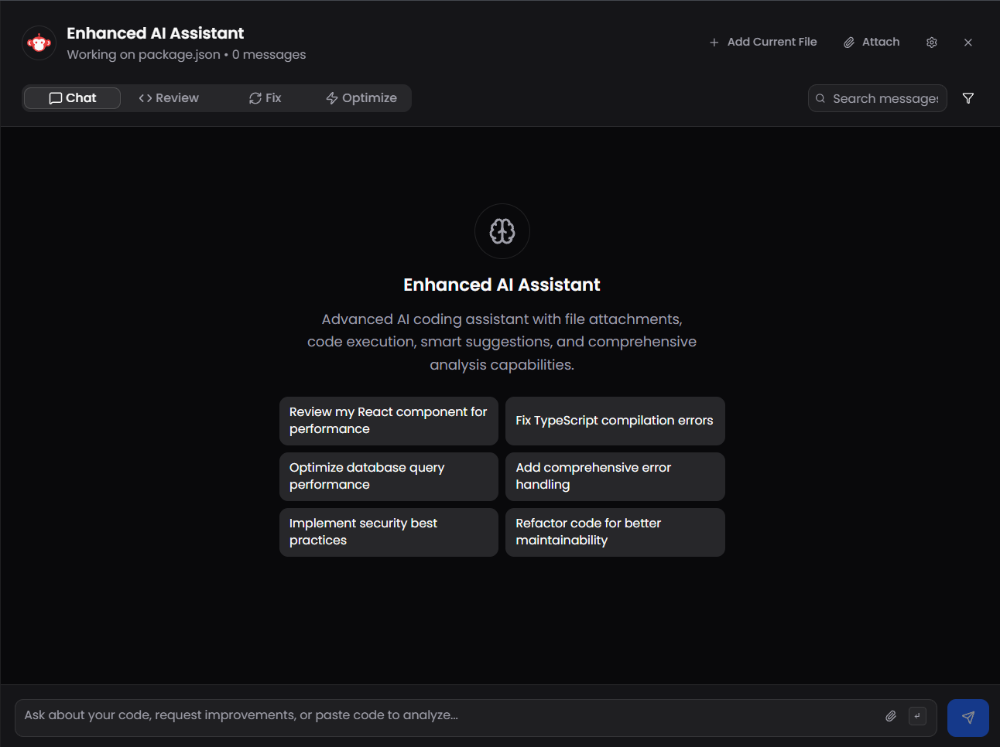
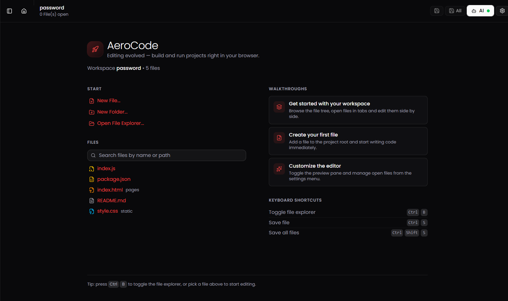
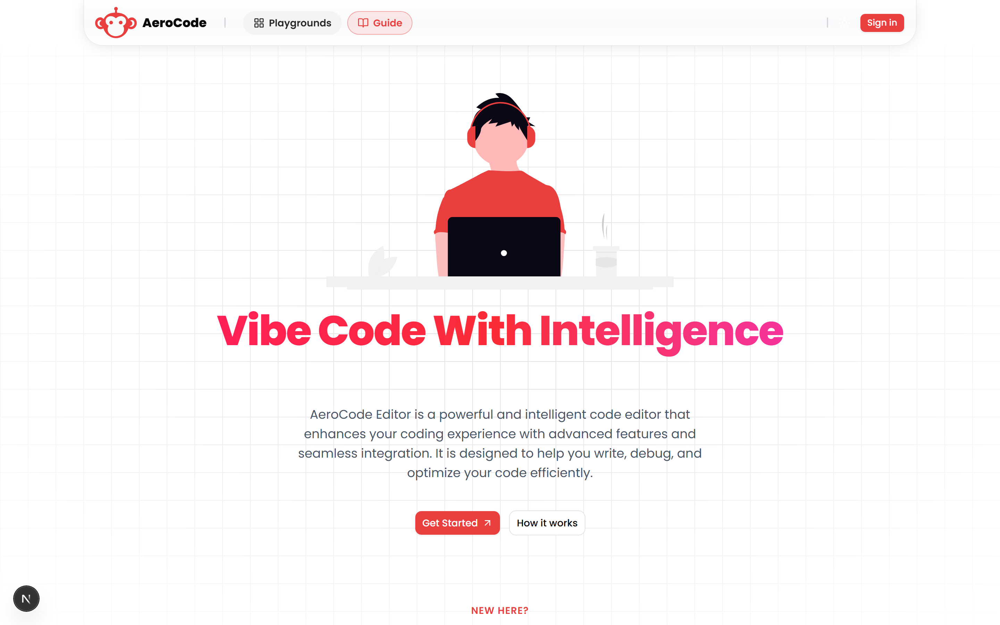
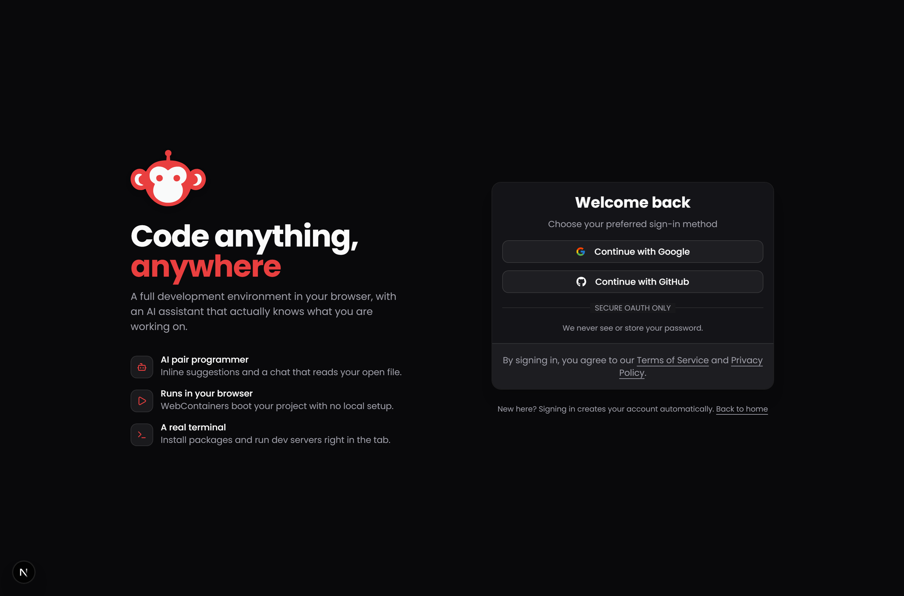
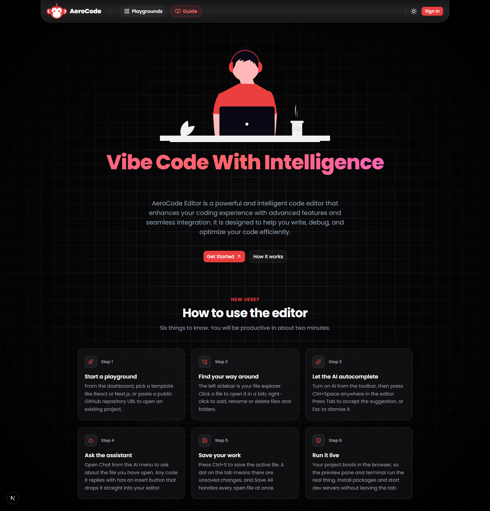
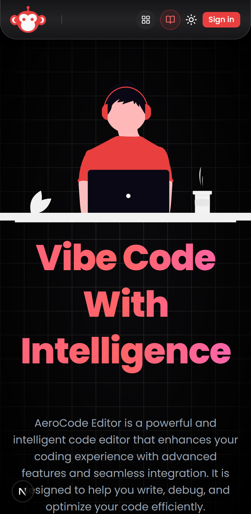
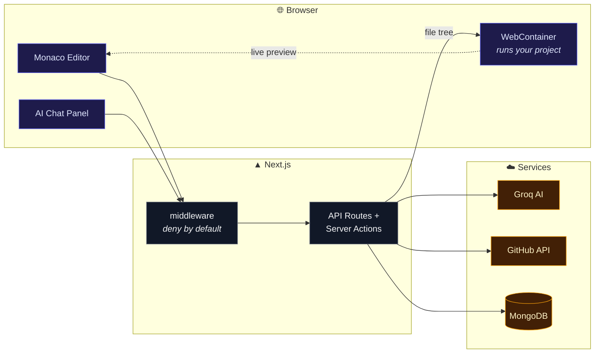

<div align="center">


# AeroCode

### Vibe code with intelligence

**A full development environment in your browser, with an AI assistant that knows what you are working on.**

Spin up a React, Next.js, Vue, Angular, Express or Hono project — or import a GitHub repo — then edit, install and run it entirely in a browser tab.

<br/>

### 🚀 [**Try the live app → aerocode-ebon.vercel.app**](https://aerocode-ebon.vercel.app/)

Sign in with Google or GitHub. No install needed.

<br/>


<br/>

**[Architecture](docs/architecture.md)** · **[Setup](docs/setup.md)** · **[Deployment](docs/deployment.md)** · **[AI](docs/ai-integration.md)** · **[Database](docs/database.md)** · **[API](docs/api-reference.md)**

</div>

<br/>

<div align="center">
  
</div>

---

## ✨ What it does

<table>
<tr>
<td width="50%" valign="top">

### 🚀 Real runtime, no server
Projects boot in-browser through [WebContainers](https://webcontainers.io/). `npm install` and dev servers run in the tab — your code never executes on a server.

</td>
<td width="50%" valign="top">

### 🤖 AI that reads your file
`Ctrl+Space` for inline completion, `Tab` to accept. The chat panel knows which file you have open and can insert its answers straight into the editor.

</td>
</tr>
<tr>
<td width="50%" valign="top">

### 📝 The VS Code editor
Monaco, with custom `modern-light` and `modern-dark` themes that follow the app theme live.

</td>
<td width="50%" valign="top">

### 🐙 Import from GitHub
Paste any public repository URL and it becomes a playground — binaries, lockfiles and `node_modules` filtered out.

</td>
</tr>
<tr>
<td width="50%" valign="top">

### 🗂️ Six starter templates
React, Next.js, Vue, Angular, Express and Hono, scanned from disk into the editor's file tree.

</td>
<td width="50%" valign="top">

### 💾 Conversations that persist
Chat history is stored per playground and scoped per user, so it survives reloads and follows you across devices.

</td>
</tr>
</table>

---

## 📸 Screenshots

### The editor
Monaco on the left. On the right, a WebContainer boots the project — mounting files and running `npm install` in the tab — with a live terminal underneath. The preview appears here once the dev server starts.



### Dashboard
Start a playground from a template or import a GitHub repository, then manage everything you have built.



### AI assistant
Chat, Review, Fix and Optimize modes in a side panel that tracks the file you have open — note *"Working on package.json"*. Replies render as rich code blocks with **Insert into editor**, copy, download and run.



### Playground welcome
Walkthroughs, fuzzy file search and keyboard shortcuts, before you open a file.



<table>
<tr>
<td width="50%" valign="top" align="center">

**Light mode**<br/>


</td>
<td width="50%" valign="top" align="center">

**Sign in**<br/>


</td>
</tr>
</table>

<details>
<summary><b>More — the built-in guide and mobile layout</b></summary>
<br/>



<div align="center">
  
</div>

</details>

---

## 🏗️ How it works



Full diagrams, request flows and design trade-offs live in **[docs/architecture.md](docs/architecture.md)**.

---

## ⚡ Quick start

```bash
git clone https://github.com/ayushYadav1107/aerocode.git
cd aerocode

npm install              # also runs `prisma generate`
cp .env.example .env     # then fill in the values
npx prisma db push       # create collections + indexes
npm run dev
```

Open <http://localhost:3000>.

You will need a MongoDB connection string, Google and GitHub OAuth credentials, and a free [Groq API key](https://console.groq.com/keys). Every variable is documented in **[docs/setup.md](docs/setup.md)**.

---

## 🌐 Deployment

AeroCode is deployed on Vercel's free tier at **<https://aerocode-ebon.vercel.app>**, backed by MongoDB Atlas and the Groq API.

OAuth callbacks registered with each provider:

| Provider | Callback URL |
|---|---|
| GitHub | `https://aerocode-ebon.vercel.app/api/auth/callback/github` |
| Google | `https://aerocode-ebon.vercel.app/api/auth/callback/google` |

> [!IMPORTANT]
> Sign in from `aerocode-ebon.vercel.app`, not from a deployment-specific URL like `aerocode-<hash>-<team>.vercel.app`. Vercel gives every build its own unique URL, and OAuth callbacks are matched exactly, so signing in from one of those fails with `redirect_uri_mismatch`.

Step-by-step instructions, environment variables and the build gotchas are in **[docs/deployment.md](docs/deployment.md)**.

---

## 🧱 Stack

| Layer | Choice |
|---|---|
| **Framework** | Next.js 16 — App Router, Turbopack, React Compiler |
| **UI** | React 19, Tailwind CSS v4, shadcn/ui, next-themes |
| **Editor** | Monaco via `@monaco-editor/react` |
| **Runtime** | WebContainers + xterm.js |
| **Auth** | Auth.js (NextAuth v5) — Google + GitHub OAuth, JWT sessions |
| **Data** | MongoDB Atlas via Prisma |
| **AI** | Groq (`openai/gpt-oss-120b`), OpenAI-compatible API |
| **State** | Zustand |

---

## 📚 Documentation

| Doc | What's inside |
|---|---|
| **[Architecture](docs/architecture.md)** | System diagrams, auth flow, the playground lifecycle, why WebContainers need special headers |
| **[Setup](docs/setup.md)** | Local install, every environment variable, OAuth configuration, troubleshooting |
| **[Deployment](docs/deployment.md)** | Deploying free on Vercel, the live URL, and the gotchas that break the build or sign-in |
| **[AI integration](docs/ai-integration.md)** | The Groq client, both AI routes, and the code-fence normalizer |
| **[Database](docs/database.md)** | Prisma schema, ER diagram, and how file trees are stored |
| **[API reference](docs/api-reference.md)** | Every route, its payload, and its failure modes |

---

## 🛠️ Scripts

```bash
npm run dev     # dev server (Turbopack)
npm run build   # production build — type-checks the whole project
npm start       # serve the production build
npm run lint    # eslint

node --test app/api/chat/normalize-code-fences.test.ts
node --test app/api/github-import/repo-tree.test.ts
```

---

## 📁 Project layout

```
app/                     routes and API handlers
├── api/chat/            AI chat + code-fence normalizer
├── api/code-suggestion/ inline editor completions
├── api/github-import/   repo → playground conversion
└── api/template/[id]/   reads a starter template off disk

features/                feature-scoped UI, hooks and server actions
├── ai-chat/             chat panel, code blocks, persistence
├── playground/          editor, file tree, playground actions
├── webContainers/       in-browser runtime + terminal
├── auth/                session helpers and user menu
└── dashboard/           sidebar, project table, import dialog

lib/                     prisma client, groq client, utils
prisma/                  schema
Aerocode-starters/       project templates copied into new playgrounds
docs/                    documentation and screenshots
```

---

## 📄 License

[MIT](LICENSE) © Ayush Yadav
