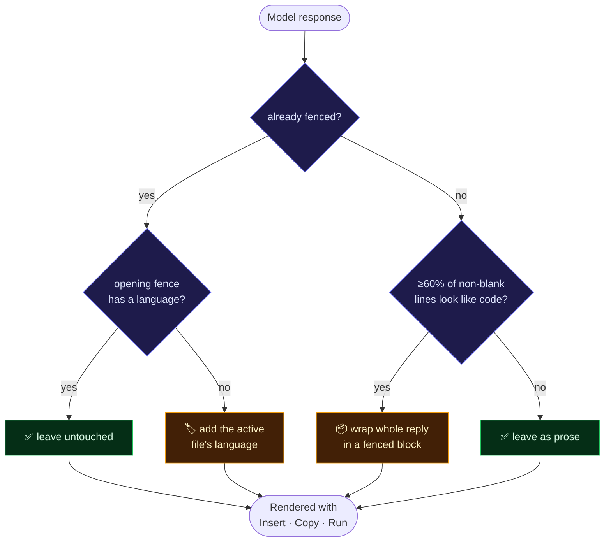

# AI integration

[← Back to README](../README.md)

How the assistant works: one shared client, two routes, and a formatting safety net.

---

## Provider

AeroCode uses **Groq**, which serves open models behind an OpenAI-compatible API. It was chosen because the free tier needs no credit card and inference is fast — a full-context coding answer returns in roughly 1–2 seconds.

The client is a plain `fetch` in [`lib/groq.ts`](../lib/groq.ts) rather than an SDK, since the endpoint is one POST.

```ts
groqChat(messages, { temperature?, maxTokens? }) => Promise<string>
```

| Setting | Default |
|---|---|
| `GROQ_MODEL` | `openai/gpt-oss-120b` |
| `GROQ_TIMEOUT_MS` | `30000` |

> [!IMPORTANT]
> Available models vary by Groq account. If you see `model_not_found`, list what your key can reach and set `GROQ_MODEL` accordingly:
> ```bash
> curl -s https://api.groq.com/openai/v1/models -H "Authorization: Bearer $GROQ_API_KEY"
> ```

### Errors are specific on purpose

`groqChat` translates failures into messages a user can act on, rather than a generic 500:

| Condition | Message |
|---|---|
| No key | "GROQ_API_KEY is not set. Get a free key at…" |
| 401 | "GROQ_API_KEY is invalid…" |
| 429 | "Groq's free-tier rate limit was hit. Wait a moment…" |
| Timeout | "Groq took longer than Ns to respond." |

The chat panel renders the reason it gets back, so a failure tells you what to fix.

---

## Chat — `/api/chat`

Conversational assistant, used by the side panel.

**Request**
```jsonc
{
  "message": "string",
  "history": [{ "role": "user" | "assistant", "content": "string" }],
  "language": "python",          // optional, from the open file
  "action": "enhance"            // optional — prompt-enhancement mode
}
```

**Response**
```jsonc
{ "response": "markdown string", "timestamp": "ISO" }
```

The route prepends a system prompt with strict formatting rules, sends the last 10 history messages for context, and passes the reply through the normalizer below.

### The code-fence normalizer

[`normalize-code-fences.ts`](../app/api/chat/normalize-code-fences.ts) exists because language models sometimes return code with no ``` fence, or a fence with no language tag. Either case renders as plain prose in react-markdown, which means the chat panel never mounts its code-block component — so you lose syntax highlighting and the **Insert into editor** button.

It repairs two cases:



The 60% threshold is what stops ordinary prose being swallowed into a code block:

```
"function f() {"          → wrapped
"You should memoize it."  → left alone
```

Covered by `normalize-code-fences.test.ts`, including the prose boundary.

> This is a safety net, not the primary mechanism. The system prompt asks for fenced output and current models comply; the normalizer only matters when one doesn't.

---

## Inline completion — `/api/code-suggestion`

Powers `Ctrl+Space` in the editor.

**Request**
```jsonc
{
  "fileContent": "string",
  "cursorLine": 0,
  "cursorColumn": 0,
  "suggestionType": "completion",
  "fileName": "index.ts"
}
```

Before prompting, the route analyses context locally — language, framework, 10 lines either side of the cursor, whether you're inside a function or class, whether you're after a comment, and which incomplete patterns sit before the cursor (`if (`, `=>`, an open brace, and so on). That analysis goes into the prompt so the completion fits where it lands.

The reply is stripped of fences and any `|CURSOR|` marker before being handed to Monaco. If anything fails it returns `// AI suggestion unavailable` rather than throwing, so a dropped request never interrupts typing.

### In the editor

| Key | Action |
|---|---|
| `Ctrl+Space` | Request a suggestion |
| `Tab` | Accept |
| `Esc` | Dismiss |

Suggestions render as Monaco inline completions (ghost text). The AI toggle in the toolbar disables the whole path.

---

## Chat persistence

Conversations are stored per playground so they survive reloads and follow you between devices.

[`features/ai-chat/actions/index.ts`](../features/ai-chat/actions/index.ts) exposes three server actions:

| Action | Behaviour |
|---|---|
| `getChatHistory(playgroundId)` | Last 10 messages, oldest first |
| `saveChatMessage(...)` | Appends, then trims beyond the 10 most recent |
| `clearChatHistory(...)` | Wipes the thread |

Every query is scoped by `userId` as well as `playgroundId`, so one user cannot read another's history.

> [!NOTE]
> This file is `"use server"`, which means **only async functions may be exported**. A plain exported `const` there is a build error — keep constants unexported or in another module.

---

## Changing provider

Because everything funnels through `groqChat`, swapping providers means editing one file. Any OpenAI-compatible endpoint (OpenAI, OpenRouter, Together, a local Ollama with its compat layer) needs only a different base URL, key and model.

---

## Related

- [API reference](api-reference.md)
- [Architecture](architecture.md)
