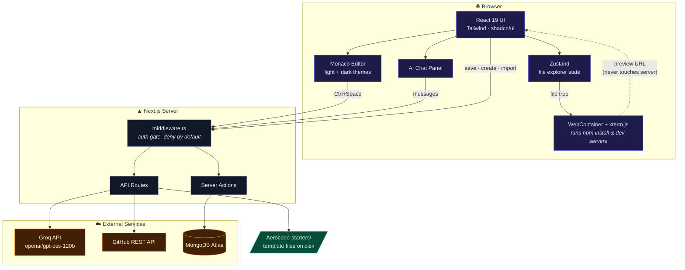
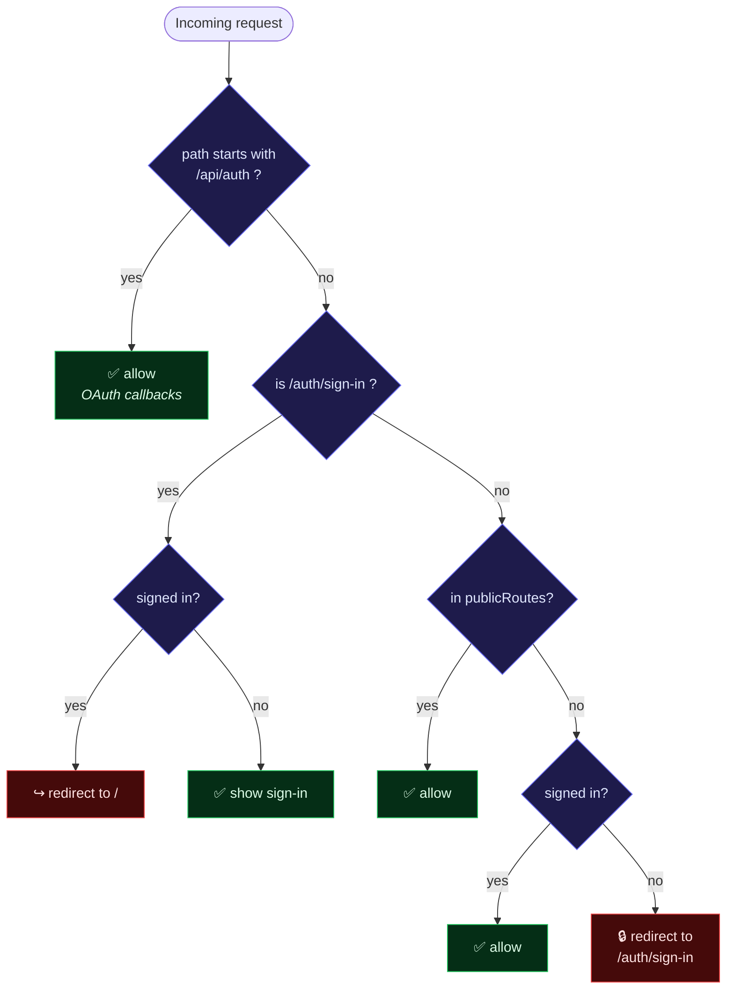
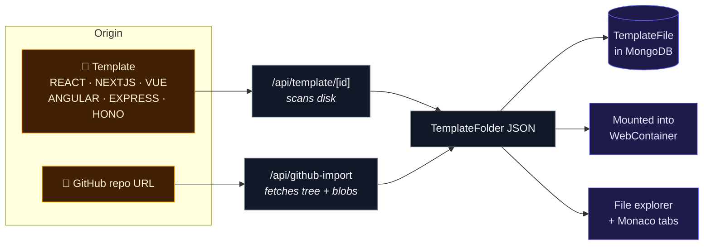
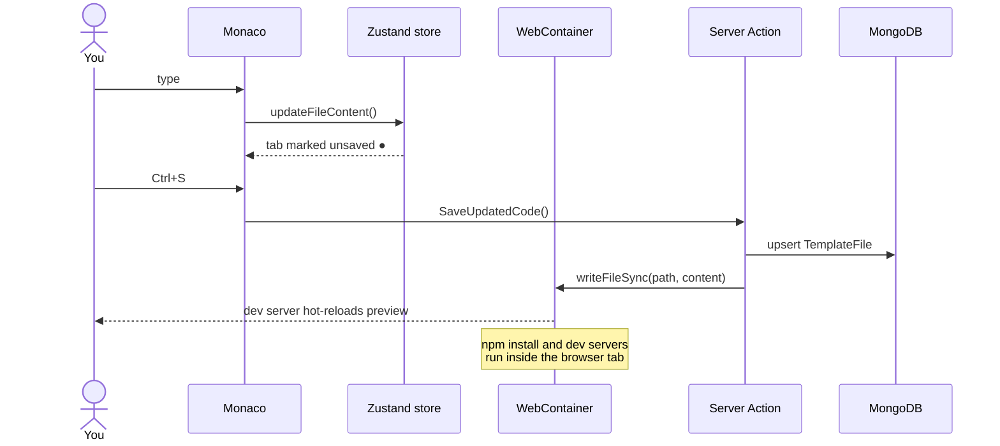
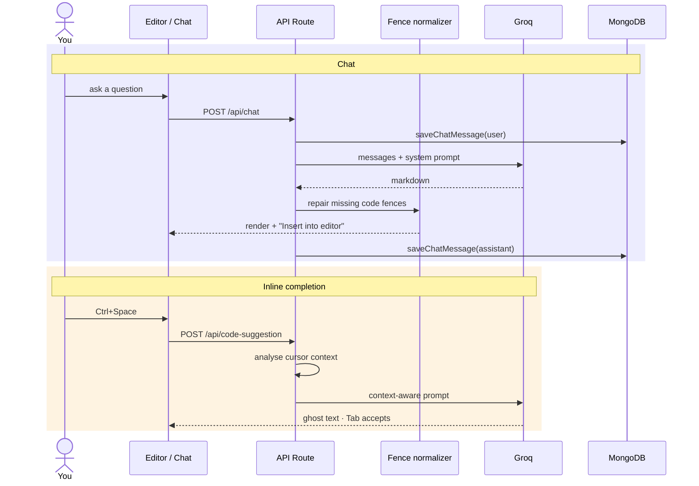

# Architecture

[← Back to README](../README.md)

How AeroCode is put together, and why a few unusual choices exist.

---

## System overview

AeroCode is a single Next.js App Router application. There is no separate backend — API routes and server actions do the server work, MongoDB stores state, and user code *runs in the browser* rather than on a server.



The important idea: **user code never executes on the server.** WebContainers run a Node-compatible runtime compiled to WebAssembly inside the tab. The server only ever stores and retrieves *text*.

---

## Layout convention

Code is grouped by feature, not by type:

```
features/<feature>/
├── components/   UI for this feature
├── hooks/        client state
├── actions/      "use server" server actions
└── libs/         pure helpers
```

`app/` holds only routing and API handlers and delegates into `features/`. Shared primitives live in `components/ui` (shadcn) and `lib/`.

---

## Authentication

Auth.js (NextAuth v5) with Google and GitHub OAuth, a **JWT session strategy**, and the Prisma adapter for user/account persistence.



The model is **deny by default**. Adding a page protects it automatically; making something public means adding it to `publicRoutes` in [`routes.ts`](../routes.ts).

> [!IMPORTANT]
> `trustHost: true` is set in [`auth.ts`](../auth.ts). Without it Auth.js rejects requests whose `Host` header it cannot verify, which breaks every deployment that is not localhost.

---

## The playground

### How files are stored

A playground's files live as a single JSON blob — a `TemplateFolder` tree — in the `TemplateFile` collection:

```ts
type TemplateFile   = { filename: string; fileExtension: string; content: string }
type TemplateFolder = { folderName: string; items: (TemplateFile | TemplateFolder)[] }
```

This denormalised shape means opening a playground is one query rather than a tree of joins, and the whole tree can be handed to a WebContainer in one go.

> [!NOTE]
> The trade-off: a single file edit rewrites the whole document. Fine at playground scale, wrong for a real filesystem.

### Where the files come from

Two sources produce an identical tree, so everything downstream is unaware of the origin:



Client-side, [`useFileExplorer`](../features/playground/hooks/useFileExplorer.tsx) (Zustand) owns open tabs, the active file, and unsaved-change flags.

### Editing and running



> [!IMPORTANT]
> WebContainers require **cross-origin isolation**. [`next.config.ts`](../next.config.ts) sets `Cross-Origin-Opener-Policy: same-origin` and `Cross-Origin-Embedder-Policy` on every route. The COEP value lives in [`coep.ts`](../features/webContainers/coep.ts) so the header and client agree on one value — it is `require-corp`, because `credentialless` is Chromium-only and breaks Firefox and Safari. Remove these headers and the preview stops working entirely.

---

## AI

Two routes, one shared client. Detail in **[AI integration](ai-integration.md)**.



[`lib/groq.ts`](../lib/groq.ts) is a plain `fetch` against Groq's OpenAI-compatible endpoint — no SDK dependency. Chat history is persisted per playground and scoped by user, so it survives reloads and follows you across devices.

---

## Theming

`next-themes` with the `class` strategy drives both the UI and the editor:

| Surface | Mechanism |
|---|---|
| UI components | Semantic Tailwind tokens (`bg-background`, `text-muted-foreground`) flip automatically |
| Monaco | Two registered themes, `modern-dark` / `modern-light`, swapped live by `setEditorTheme` |
| Chat code blocks | `react-syntax-highlighter` style switched on the same signal |

---

## A note on file tracing

`/api/template/[id]` reads `Aerocode-starters/` with a path built at runtime. Build-time tracers cannot see dynamic `fs` access, so the directory would be missing from a serverless bundle. `outputFileTracingIncludes` in [`next.config.ts`](../next.config.ts) forces it in. See [Deployment → The gotchas](deployment.md#the-gotchas).

---

## Related

- [Database schema](database.md)
- [API reference](api-reference.md)
- [Deployment](deployment.md)
