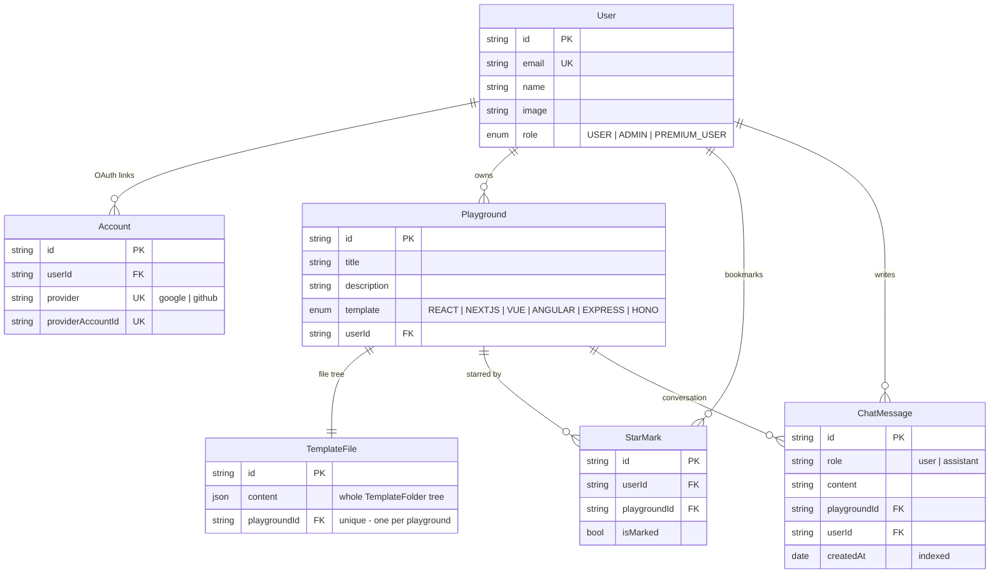

# Database

[← Back to README](../README.md)

MongoDB accessed through Prisma. Schema lives in [`prisma/schema.prisma`](../prisma/schema.prisma).

---

## Why MongoDB

Prisma's MongoDB connector requires a **replica set** — a standalone `mongod` will not work. Atlas provides one on the free tier.

Because it is MongoDB rather than SQL, there are no migration files. `prisma db push` reconciles collections and indexes directly, and refuses destructive changes unless you pass `--accept-data-loss`.

```bash
npx prisma db push      # apply schema
npx prisma generate     # regenerate client (also runs on npm install)
npx prisma studio       # browse data
```

The client is generated to `lib/generated/prisma` (not the default location) and is not committed.

---

## Models

### `User`

| Field | Type | Notes |
|---|---|---|
| `id` | `String` | `@id @default(cuid()) @map("_id")` |
| `name` | `String?` | From the OAuth profile |
| `email` | `String` | Unique |
| `image` | `String?` | Avatar URL |
| `role` | `UserRole` | `ADMIN` \| `USER` \| `PREMIUM_USER`, defaults `USER` |

Relations: `accounts`, `myPlayground`, `staredPlayground`, `chatMessages`.

### `Account`

Auth.js OAuth account linkage — provider, tokens, scope. Unique on `[provider, providerAccountId]`, indexed on `userId`. Cascades on user delete.

> Sessions are JWT, so there is no `Session` collection.

### `Playground`

| Field | Type | Notes |
|---|---|---|
| `title` | `String` | |
| `description` | `String?` | |
| `template` | `Templates` | `REACT` \| `NEXTJS` \| `EXPRESS` \| `VUE` \| `HONO` \| `ANGULAR` |
| `userId` | `String` | Owner; cascades |

### `TemplateFile`

Holds a playground's entire file tree as one JSON document.

| Field | Type | Notes |
|---|---|---|
| `content` | `Json` | Serialised `TemplateFolder` |
| `playgroundId` | `String` | **`@unique`** — one per playground |

The tree:

```ts
type TemplateFile   = { filename: string; fileExtension: string; content: string }
type TemplateFolder = { folderName: string; items: (TemplateFile | TemplateFolder)[] }
```

Storing the tree whole means loading a playground is a single read and the result can be mounted straight into a WebContainer. The cost is that saving any one file rewrites the document — acceptable at playground size, unsuitable for large repositories.

Because `playgroundId` is unique, saves use `upsert`.

### `StarMark`

Bookmarks. Unique on `[userId, playgroundId]`, so starring is idempotent.

### `ChatMessage`

Per-playground AI conversation.

| Field | Type | Notes |
|---|---|---|
| `role` | `String` | `"user"` or `"assistant"` |
| `content` | `String` | |
| `playgroundId` | `String` | Cascades |
| `userId` | `String` | Cascades |
| `createdAt` | `DateTime` | Ordering key |

Indexed on `[playgroundId, userId, createdAt]` — the exact shape of the history query. Trimmed to the 10 most recent messages per playground on each write.

---

## Relationships



Every relation cascades from `User` and `Playground`, so deleting either cleans up completely.

---

## Access patterns

Data access goes through server actions, never direct client queries:

| Location | Responsibility |
|---|---|
| [`features/playground/actions`](../features/playground/actions/index.ts) | Playgrounds: create, list, delete, duplicate, save files, import from repo |
| [`features/ai-chat/actions`](../features/ai-chat/actions/index.ts) | Chat history |
| [`features/auth/actions`](../features/auth/actions/index.ts) | `currentUser()` and account lookups |

Every action resolves the session itself and scopes queries by `userId`. Ownership is never taken from client input.

---

## Related

- [Architecture](architecture.md)
- [Setup](setup.md)
